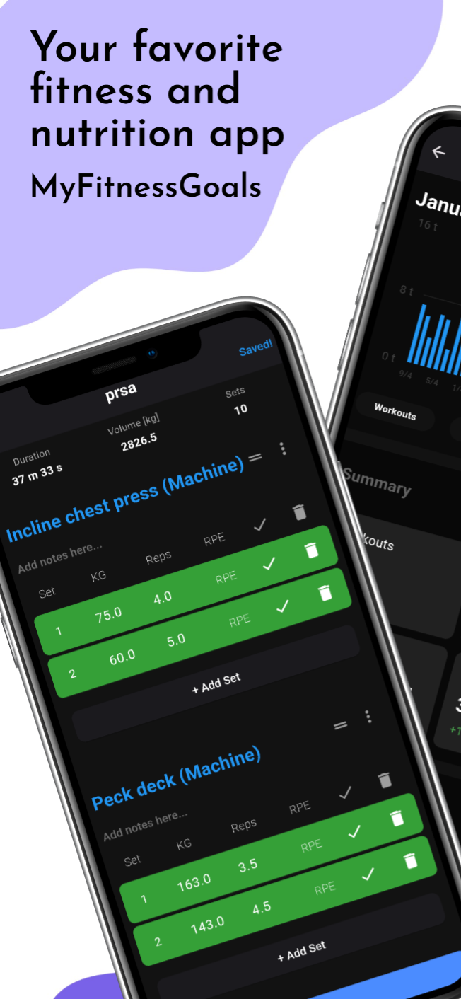
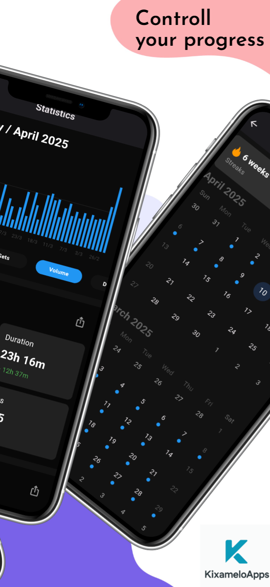
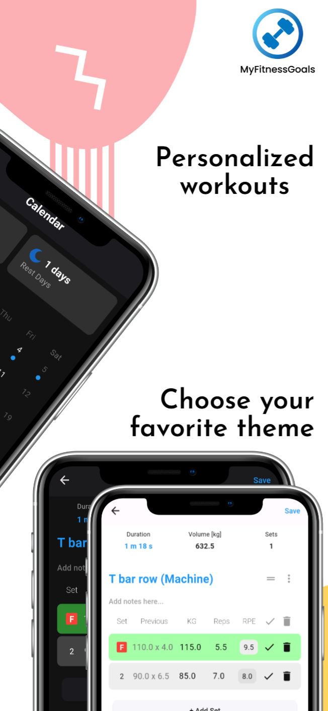
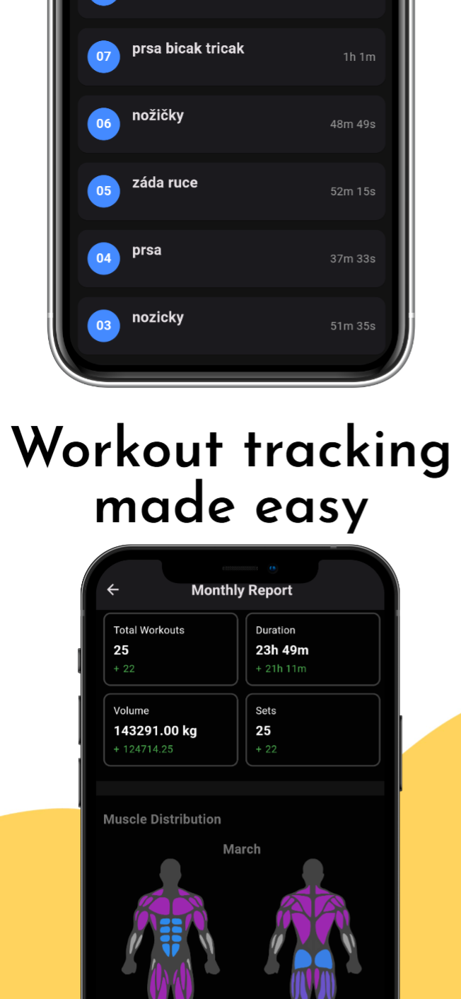
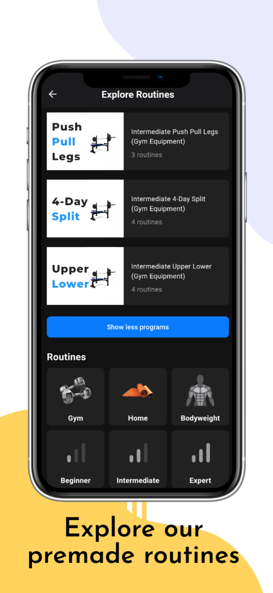

# MyFitnessGoals

**MyFitnessGoals** is a modern fitness app designed to help you achieve your personal health and fitness goals — whether you're looking to build muscle, lose weight, or simply stay active.

## ✨ Features

- 🏋️ Log workouts with detailed sets, reps, and weights  
- 🍎 Track your daily intake of macronutrients and micronutrients using an integrated food database (OpenFoodFacts)  
- 📋 Save and follow training plans based on your fitness level (Beginner, Intermediate, Advanced)  
- 🧩 Create and customize your own workouts  
- 🌙 Clean, user-friendly design with dark mode support  

## 🔒 Your Data, Your Control

All your personal data is securely stored. You can request to delete some or all of your data at any time without deleting your entire account.

## 💪 For All Fitness Levels

Whether you're just starting out or you're an experienced athlete, MyFitnessGoals provides the tools to help you stay motivated and consistent.

---

## 📸 Screenshots

|  |  |  |  |  |
|:---------------------------:|:---------------------------:|:---------------------------:|:---------------------------:|:---------------------------:|
